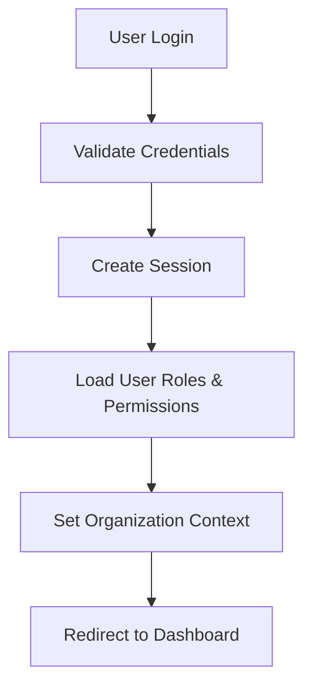
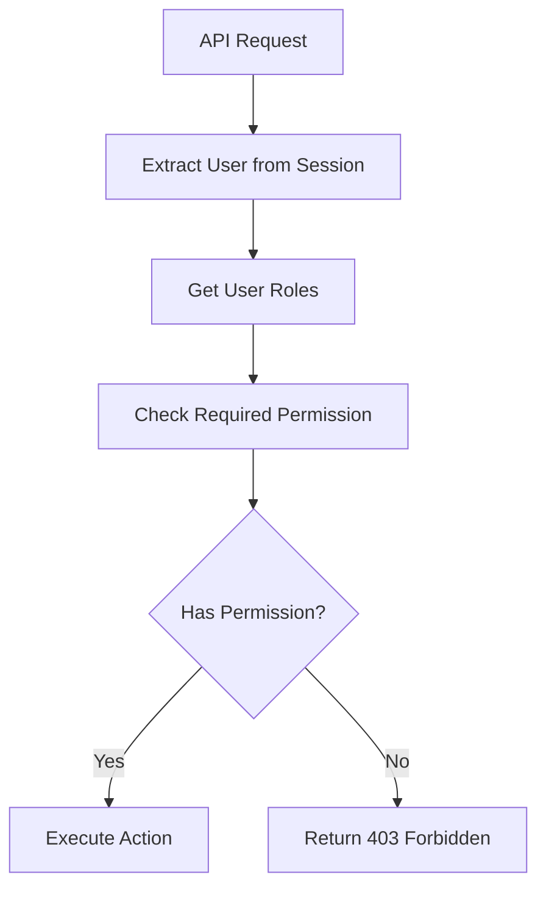
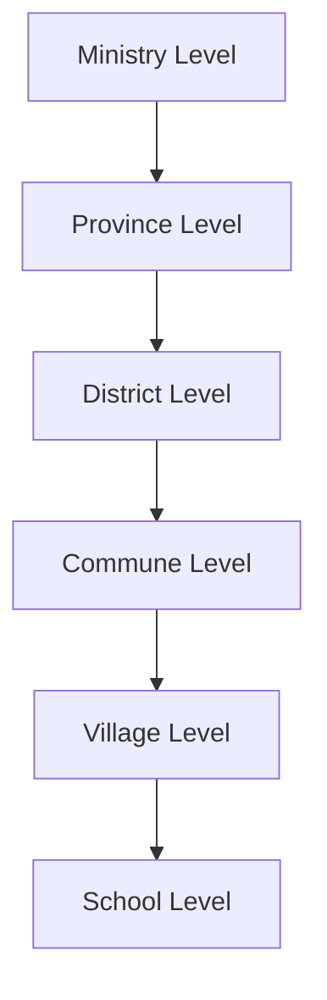
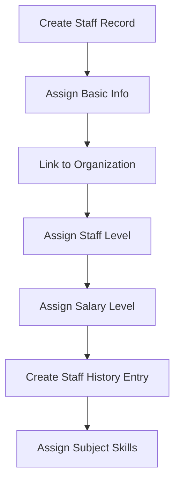
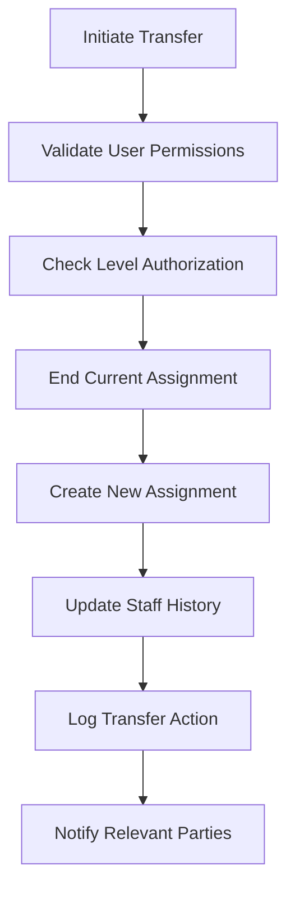

# Teacher Management System - Complete Flow Guideline

## Table of Contents
1. [System Architecture Overview](#system-architecture-overview)
2. [Authentication & Authorization Flow](#authentication--authorization-flow)
3. [Permission Grouping System](#permission-grouping-system)
4. [Organization-Level Access Control](#organization-level-access-control)
5. [Hierarchical Level Management](#hierarchical-level-management)
6. [Staff Management & History](#staff-management--history)
7. [Staff Transfer System](#staff-transfer-system)
8. [Staff Subject Skills](#staff-subject-skills)
9. [Location Management](#location-management)
10. [Audit & Activity Logging](#audit--activity-logging)
11. [API Testing Strategy](#api-testing-strategy)

## Sample Data Creation & Testing Flow

To test the Timetable Management API end-to-end, follow these steps using the provided Postman collection:

### 1. Import the Postman Collection
- Open Postman and import `Teacher_MS_API.postman_collection.json`.
- Set the `base_url` variable to your API server (e.g., `http://localhost:3000`).

### 2. Authenticate (if required)
- Use the Authentication folder to log in and obtain a token.
- The token will be set as `auth_token` for subsequent requests.

### 3. Create Required Sample Data
Use the **Sample Data Creation** folder in this order:
1. **Create Academic Year**
2. **Create Grade Level**
3. **Create Subject**
4. **Create Staff (Teacher)**
5. **Create Classroom**
6. **Assign Subject to Staff** (use the IDs from steps 3 and 4)

> **Tip:** After each creation, copy the returned `id` from the response and use it in the next request where needed (e.g., for `staffId`, `subjectId`, etc.).

### 4. Create and Test Timetable Entries
- Go to the **Timetable Management** folder.
- Use the IDs from your created data in the POST/PUT requests for timetable entries.
- Test conflict detection by trying to create overlapping entries for the same staff or classroom.

### 5. List, Update, and Delete Timetable Entries
- Use the GET, PUT, and DELETE requests in the Timetable Management folder to manage and verify timetable entries.

### 6. Advanced Testing
- Try filtering timetable entries by staff, classroom, or day of week.
- Assign multiple subjects to a staff member and create entries for each.

---

## 1. System Architecture Overview

### Technology Stack
- **Frontend**: Next.js 14 with TypeScript
- **Backend**: Next.js API Routes
- **Database**: MongoDB with Prisma ORM
- **Authentication**: NextAuth.js
- **Authorization**: Role-Based Access Control (RBAC)

### Core Models
```
User → Roles → Permissions → PermissionGroups
User → UserLevel → LevelType → Organization
Staff → StaffHistory → Organization
Staff → StaffSubject → Subject
```

---

## 2. Authentication & Authorization Flow

### Login Process


### Permission Checking Flow


### Implementation
```typescript
// middleware/checkPermission.ts
export async function checkPermission(userId: string, permissionCode: string): Promise<boolean> {
  const user = await prisma.user.findUnique({
    where: { id: userId },
    include: {
      roles: {
        include: {
          role: {
            include: {
              permission: {
                include: {
                  permission: true
                }
              }
            }
          }
        }
      }
    }
  });

  return user.roles.some(userRole => 
    userRole.role.permission.some(rolePerm => 
      rolePerm.permission.code === permissionCode
    )
  );
}
```

---

## 3. Permission Grouping System

### Permission Group Structure
```
PermissionGroup
├── name_en: "User Management"
├── name_kh: "ការគ្រប់គ្រងអ្នកប្រើប្រាស់"
├── code: "user_management"
└── permissions: [
    "user_create",
    "user_read", 
    "user_update",
    "user_delete"
  ]
```

### Frontend Implementation
```typescript
// Grouped Permission Selector Component
const PermissionSelector = ({ selectedPermissions, onChange }) => {
  const [permissionGroups, setPermissionGroups] = useState([]);

  useEffect(() => {
    // Fetch permission groups with their permissions
    fetchPermissionGroups();
  }, []);

  return (
    <div>
      {permissionGroups.map(group => (
        <div key={group.id}>
          <h3>{group.name_en}</h3>
          {group.permissions.map(permission => (
            <Checkbox
              key={permission.id}
              checked={selectedPermissions.includes(permission.id)}
              onChange={(checked) => handlePermissionChange(permission.id, checked)}
            >
              {permission.name_en}
            </Checkbox>
          ))}
        </div>
      ))}
    </div>
  );
};
```

### API Endpoints
- `GET /api/auth/permissions/group` - List all permission groups
- `POST /api/auth/permissions/group` - Create new permission group
- `PUT /api/auth/permissions/group/[id]` - Update permission group
- `DELETE /api/auth/permissions/group/[id]` - Delete permission group

---

## 4. Organization-Level Access Control

### Multi-Tenancy Implementation
```typescript
// Organization scoping in API routes
const getOrganizationScopedData = async (userId: string) => {
  const user = await prisma.user.findUnique({
    where: { id: userId },
    include: { organization: true }
  });

  // All queries are scoped to user's organization
  return prisma.staff.findMany({
    where: {
      organization_id: user.organization_id
    }
  });
};
```

### Level-Based Authorization
```typescript
// Check if user can manage specific level
const canManageLevel = async (userLevelId: string, targetLevelId: string) => {
  const userLevel = await prisma.userLevel.findUnique({
    where: { id: userLevelId },
    include: { level_type: true }
  });

  const targetLevel = await prisma.userLevel.findUnique({
    where: { id: targetLevelId },
    include: { level_type: true }
  });

  return userLevel.level_type.level_order <= targetLevel.level_type.level_order;
};
```

---

## 5. Hierarchical Level Management

### Level Type Configuration
```typescript
// LevelType model structure
{
  id: "level_1",
  name_en: "Ministry Level",
  name_kh: "កម្រិតអគ្គនាយកដ្ឋាន",
  level_order: 1, // Highest level
  can_manage_levels_ids: ["level_2", "level_3", "level_4"],
  managed_by_levels_ids: []
}
```

### Level Hierarchy Flow


### Implementation
```typescript
// Get manageable levels for a user
const getManageableLevels = async (userLevelId: string) => {
  const userLevel = await prisma.userLevel.findUnique({
    where: { id: userLevelId },
    include: { level_type: true }
  });

  return prisma.userLevel.findMany({
    where: {
      level_type: {
        id: { in: userLevel.level_type.can_manage_levels_ids }
      }
    }
  });
};
```

---

## 6. Staff Management & History

### Staff Creation Flow


### Staff History Tracking
```typescript
// StaffHistory model tracks changes
{
  staff_id: "staff_123",
  organization_id: "org_456",
  position: "Teacher",
  start_date: "2023-09-01",
  end_date: null, // Current assignment
  staff_level_id: "level_3",
  salary_level_id: "salary_2",
  academic_year_id: "2023-2024",
  changed_by_id: "user_789"
}
```

### Historical Data Query
```typescript
// Get staff assignment history
const getStaffHistory = async (staffId: string) => {
  return prisma.staffHistory.findMany({
    where: { staff_id: staffId },
    include: {
      organization: true,
      staff_level: true,
      salary_level: true,
      academic_year: true,
      changed_by: true
    },
    orderBy: { start_date: 'desc' }
  });
};
```

---

## 7. Staff Transfer System

### Transfer Process Flow


### Transfer API Implementation
```typescript
// POST /api/staff/transfer
export async function POST(request: NextRequest) {
  const { staffId, newOrganizationId, newPosition, effectiveDate, note } = await request.json();
  
  // 1. Validate permissions
  const hasPermission = await checkPermission(session.user.id, 'staff_transfer');
  
  // 2. Check level authorization
  const canTransfer = await checkLevelAuthorization(userLevelId, targetLevelId);
  
  // 3. End current assignment
  await prisma.staffHistory.updateMany({
    where: { 
      staff_id: staffId,
      end_date: null 
    },
    data: { end_date: effectiveDate }
  });
  
  // 4. Create new assignment
  await prisma.staffHistory.create({
    data: {
      staff_id: staffId,
      organization_id: newOrganizationId,
      position: newPosition,
      start_date: effectiveDate,
      changed_by_id: session.user.id,
      note
    }
  });
  
  // 5. Log the action
  await logAuditAction('STAFF_TRANSFER', session.user.id, details);
}
```

---

## 8. Staff Subject Skills

### Subject Skills Structure
```typescript
// Many-to-many relationship
StaffSubject {
  staff_id: "staff_123",
  subject_id: "math_001"
}

Subject {
  id: "math_001",
  name_en: "Mathematics",
  name_kh: "គណិតវិទ្យា",
  code: "MATH",
  is_active: true
}
```

### Staff Skills Management
```typescript
// Add subjects to staff
const addStaffSubjects = async (staffId: string, subjectIds: string[]) => {
  // Remove existing subjects
  await prisma.staffSubject.deleteMany({
    where: { staff_id: staffId }
  });
  
  // Add new subjects
  await prisma.staffSubject.createMany({
    data: subjectIds.map(subjectId => ({
      staff_id: staffId,
      subject_id: subjectId
    }))
  });
};

// Get staff with subjects
const getStaffWithSubjects = async (staffId: string) => {
  return prisma.staff.findUnique({
    where: { id: staffId },
    include: {
      staff_subjects: {
        include: {
          subject: true
        }
      }
    }
  });
};
```

---

## 8.1. Timetable Management

### Endpoints
- `GET /api/timetable-entries` — List timetable entries (with filters)
- `POST /api/timetable-entries` — Create a new timetable entry (with validation and conflict detection)
- `GET /api/timetable-entries/[id]` — Get a single timetable entry
- `PUT /api/timetable-entries/[id]` — Update a timetable entry (with validation and conflict detection)
- `DELETE /api/timetable-entries/[id]` — Delete a timetable entry

### Required Fields for Create/Update
- `academicYearId` (string)
- `gradeLevelId` (string)
- `subjectId` (string)
- `staffId` (string)
- `classroomId` (string)
- `dayOfWeek` (int, 0=Sunday, 1=Monday, ...)
- `startTime` (ISO string)
- `endTime` (ISO string)
- `periodLengthMinutes` (int)
- `sessionType` (string, optional)
- `rotationDay` (string, optional)

### Example: Create Timetable Entry
```json
POST /api/timetable-entries
{
  "academicYearId": "...",
  "gradeLevelId": "...",
  "subjectId": "...",
  "staffId": "...",
  "classroomId": "...",
  "dayOfWeek": 1,
  "startTime": "2024-06-01T08:00:00.000Z",
  "endTime": "2024-06-01T09:00:00.000Z",
  "periodLengthMinutes": 60,
  "sessionType": "Morning",
  "rotationDay": "A"
}
```

### Example: List Timetable Entries (with filters)
```
GET /api/timetable-entries?academicYearId=...&gradeLevelId=...&staffId=...&dayOfWeek=1
```

### Conflict Detection
- The API will return 409 if the staff or classroom is already assigned during the requested time slot.

### Example: Update Timetable Entry
```json
PUT /api/timetable-entries/{id}
{
  "academicYearId": "...",
  "gradeLevelId": "...",
  "subjectId": "...",
  "staffId": "...",
  "classroomId": "...",
  "dayOfWeek": 1,
  "startTime": "2024-06-01T08:00:00.000Z",
  "endTime": "2024-06-01T09:00:00.000Z",
  "periodLengthMinutes": 60,
  "sessionType": "Morning",
  "rotationDay": "A"
}
```

### Example: Delete Timetable Entry
```
DELETE /api/timetable-entries/{id}
```

---

## 9. Location Management

### Location Hierarchy
```
Province
├── District
    ├── Commune
        ├── Village
            └── Organization (School)
```

### Location Type Management
```typescript
// Dynamic location types
LocationType {
  id: "school",
  code: "SCHOOL",
  name_en: "School",
  name_kh: "សាលារៀន",
  parent_id: "village",
  order: 1
}
```

### Location-Based Access
```typescript
// Get organizations by location
const getOrganizationsByLocation = async (provinceId?: string, districtId?: string) => {
  const where: any = {};
  
  if (provinceId) where.province_id = provinceId;
  if (districtId) where.district_id = districtId;
  
  return prisma.organization.findMany({
    where,
    include: {
      province: true,
      district: true,
      commune: true,
      village: true
    }
  });
};
```

---

## 10. Audit & Activity Logging

### Audit Log Structure
```typescript
AuditLog {
  id: "audit_123",
  active: "CREATE", // CREATE, UPDATE, DELETE, LOGIN, etc.
  timestamp: "2023-12-01T10:30:00Z",
  user_id: "user_456",
  details: "Created new staff member: John Doe"
}
```

### Activity Log Structure
```typescript
ActiveLog {
  id: "session_789",
  session_id: "sess_abc123",
  start_at: "2023-12-01T09:00:00Z",
  ended_at: "2023-12-01T17:00:00Z",
  ip_address: "192.168.1.100",
  location: "Phnom Penh, Cambodia",
  user_agent: "Mozilla/5.0...",
  user_id: "user_456"
}
```

### Logging Implementation
```typescript
// Log user actions
const logAuditAction = async (action: string, userId: string, details: string) => {
  await prisma.auditLog.create({
    data: {
      active: action,
      timestamp: new Date(),
      user_id: userId,
      details
    }
  });
};

// Track user sessions
const trackUserSession = async (sessionId: string, userId: string, ipAddress: string) => {
  await prisma.activeLog.create({
    data: {
      session_id: sessionId,
      start_at: new Date(),
      ip_address: ipAddress,
      user_id: userId
    }
  });
};
```

---

## 11. API Testing Strategy

### Postman Collection Structure
```
Teacher Management System API
├── Authentication
│   ├── Login
│   ├── Logout
│   └── Session Management
├── User Management
│   ├── Create User
│   ├── Update User
│   ├── Delete User
│   └── List Users
├── Role & Permission Management
│   ├── Roles CRUD
│   ├── Permissions CRUD
│   ├── Permission Groups CRUD
│   └── Assign Permissions to Roles
├── Staff Management
│   ├── Staff CRUD
│   ├── Staff Transfer
│   ├── Staff History
│   └── Staff Subject Skills
├── Location Management
│   ├── Provinces CRUD
│   ├── Districts CRUD
│   ├── Communes CRUD
│   └── Villages CRUD
└── System Management
    ├── Organizations CRUD
    ├── Academic Years CRUD
    ├── Staff Levels CRUD
    └── Salary Levels CRUD
```

### Testing Scenarios
1. **Authentication Tests**
   - Valid login credentials
   - Invalid login credentials
   - Session expiration
   - Permission-based access

2. **Authorization Tests**
   - Role-based access control
   - Level-based authorization
   - Organization scoping
   - Permission inheritance

3. **Data Validation Tests**
   - Required field validation
   - Data type validation
   - Business rule validation
   - Constraint validation

4. **Integration Tests**
   - End-to-end workflows
   - Data consistency
   - Error handling
   - Performance testing

---

## Implementation Checklist

### Backend Implementation
- [x] Prisma schema with all models
- [x] API routes for all CRUD operations
- [x] Authentication middleware
- [x] Permission checking middleware
- [x] Level validation middleware
- [x] Audit logging service
- [x] Staff transfer logic
- [x] Organization scoping

### Frontend Implementation
- [ ] Role-based sidebar navigation
- [ ] Permission group UI components
- [ ] Staff management forms
- [ ] Transfer request forms
- [ ] Subject skills assignment
- [ ] Level-based authorization UI
- [ ] Audit log viewer
- [ ] Dashboard with statistics

### Testing & Documentation
- [x] Postman collection
- [ ] Unit tests
- [ ] Integration tests
- [ ] API documentation
- [ ] User manual
- [ ] Deployment guide

---

## Best Practices

### Security
1. Always validate user permissions before any action
2. Use organization scoping for all data queries
3. Implement proper input validation and sanitization
4. Log all sensitive actions for audit purposes
5. Use HTTPS in production

### Performance
1. Use database indexes for frequently queried fields
2. Implement pagination for large datasets
3. Use caching for static data (locations, subjects)
4. Optimize database queries with proper includes
5. Monitor query performance

### Maintainability
1. Follow consistent naming conventions
2. Use TypeScript for type safety
3. Implement proper error handling
4. Write comprehensive documentation
5. Use environment variables for configuration

### Scalability
1. Design for multi-tenancy from the start
2. Use hierarchical data structures
3. Implement proper database relationships
4. Plan for horizontal scaling
5. Use efficient data structures

This comprehensive flow guideline provides a complete overview of the Teacher Management System's architecture, implementation details, and best practices for development and maintenance.

## End-to-End API Usage Flow (with CRUD Details)

This section provides a clear, step-by-step guide for using the API, starting from login and covering CRUD operations for all main entities.

---

### 1. **Login (Authentication)**
- **Purpose:** Obtain a token for authenticated requests.
- **Endpoint:** `POST /api/auth/login`
- **Request Body:**
  ```json
  {
    "username": "admin001",
    "password": "admin123"
  }
  ```
- **Response:**
  - On success: `{ "token": "..." }`
  - Save this token as `auth_token` in Postman for all further requests.

---

### 2. **User Management (CRUD)**
- **Create User:**
  - `POST /api/auth/users`
  - Body:
    ```json
    {
      "username": "john.doe",
      "password": "securepassword",
      "roles": ["ROLE_ID"]
    }
    ```
- **List Users:**
  - `GET /api/auth/users`
- **Update User:**
  - `PUT /api/auth/users`
  - Body:
    ```json
    {
      "id": "USER_ID",
      "username": "john.doe.updated",
      "password": "newpassword",
      "roles": ["ROLE_ID"],
      "is_active": true
    }
    ```
- **Delete User:**
  - `DELETE /api/auth/users?id=USER_ID`

---

### 3. **Role & Permission Management (CRUD)**
- **Create Role:**
  - `POST /api/auth/roles`
  - Body:
    ```json
    {
      "name_en": "School Administrator",
      "name_kh": "អ្នកគ្រប់គ្រងសាលា",
      "code": "SCHOOL_ADMIN",
      "description": "Can manage school-level operations",
      "is_active": true,
      "permissions": ["PERMISSION_ID"]
    }
    ```
- **List Roles:**
  - `GET /api/auth/roles`
- **Update Role:**
  - `PUT /api/auth/roles`
  - Body: (similar to create, with `id`)
- **Delete Role:**
  - `DELETE /api/auth/roles?id=ROLE_ID`

- **Create Permission:**
  - `POST /api/auth/permissions`
  - Body:
    ```json
    {
      "name_en": "Staff Transfer",
      "name_kh": "ផ្ទេរបុគ្គលិក",
      "code": "STAFF_TRANSFER",
      "description": "Can transfer staff between organizations",
      "is_active": true
    }
    ```
- **List Permissions:**
  - `GET /api/auth/permissions`
- **Update Permission:**
  - `PUT /api/auth/permissions`
  - Body: (similar to create, with `id`)
- **Delete Permission:**
  - `DELETE /api/auth/permissions?id=PERMISSION_ID`

---

### 4. **Staff Management (CRUD)**
- **Create Staff:**
  - `POST /api/staff`
  - Body:
    ```json
    {
      "code": "T001",
      "first_name": "Sok",
      "last_name": "Dara",
      "email": "sok.dara@example.com",
      "phone": "012345678",
      "gender": "M",
      "date_of_birth": "1990-01-01T00:00:00.000Z",
      "nationality": "Khmer"
    }
    ```
- **List Staff:**
  - `GET /api/staff`
- **Update Staff:**
  - `PUT /api/staff`
  - Body: (similar to create, with `id`)
- **Delete Staff:**
  - `DELETE /api/staff?id=STAFF_ID`

---

### 5. **Subject Management (CRUD)**
- **Create Subject:**
  - `POST /api/subjects`
  - Body:
    ```json
    {
      "name_en": "Mathematics",
      "name_kh": "គណិតវិទ្យា",
      "code": "MATH",
      "is_active": true
    }
    ```
- **List Subjects:**
  - `GET /api/subjects`
- **Update Subject:**
  - `PUT /api/subjects`
  - Body: (similar to create, with `id`)
- **Delete Subject:**
  - `DELETE /api/subjects?id=SUBJECT_ID`

---

### 6. **Classroom Management (CRUD)**
- **Create Classroom:**
  - `POST /api/locations/classrooms`
  - Body:
    ```json
    {
      "schoolId": "SCHOOL_ID",
      "name": "Room 101",
      "type": "General Classroom",
      "capacity": 40
    }
    ```
- **List Classrooms:**
  - `GET /api/locations/classrooms`
- **Update Classroom:**
  - `PUT /api/locations/classrooms`
  - Body: (similar to create, with `id`)
- **Delete Classroom:**
  - `DELETE /api/locations/classrooms?id=CLASSROOM_ID`

---

### 7. **Assign Subject to Staff**
- **Assign:**
  - `POST /api/staff-subjects`
  - Body:
    ```json
    {
      "staffId": "STAFF_ID",
      "subjectId": "SUBJECT_ID"
    }
    ```
- **List Assignments:**
  - `GET /api/staff-subjects?staffId=STAFF_ID`
- **Remove Assignment:**
  - `DELETE /api/staff-subjects?id=ASSIGNMENT_ID`

---

### 8. **Timetable Management (CRUD & Conflict Detection)**
- **Create Timetable Entry:**
  - `POST /api/timetable-entries`
  - Body:
    ```json
    {
      "academicYearId": "ACADEMIC_YEAR_ID",
      "gradeLevelId": "GRADE_LEVEL_ID",
      "subjectId": "SUBJECT_ID",
      "staffId": "STAFF_ID",
      "classroomId": "CLASSROOM_ID",
      "dayOfWeek": 1,
      "startTime": "2024-09-01T08:00:00.000Z",
      "endTime": "2024-09-01T09:00:00.000Z",
      "periodLengthMinutes": 60,
      "sessionType": "Morning",
      "rotationDay": "A"
    }
    ```
- **List Timetable Entries:**
  - `GET /api/timetable-entries?staffId=STAFF_ID`
- **Update Timetable Entry:**
  - `PUT /api/timetable-entries/{id}`
  - Body: (same as create)
- **Delete Timetable Entry:**
  - `DELETE /api/timetable-entries/{id}`
- **Conflict Detection:**
  - If you try to create or update an entry that overlaps for the same staff or classroom, the API will return a 409 error.

---

Continue with the rest of the guideline as before... 