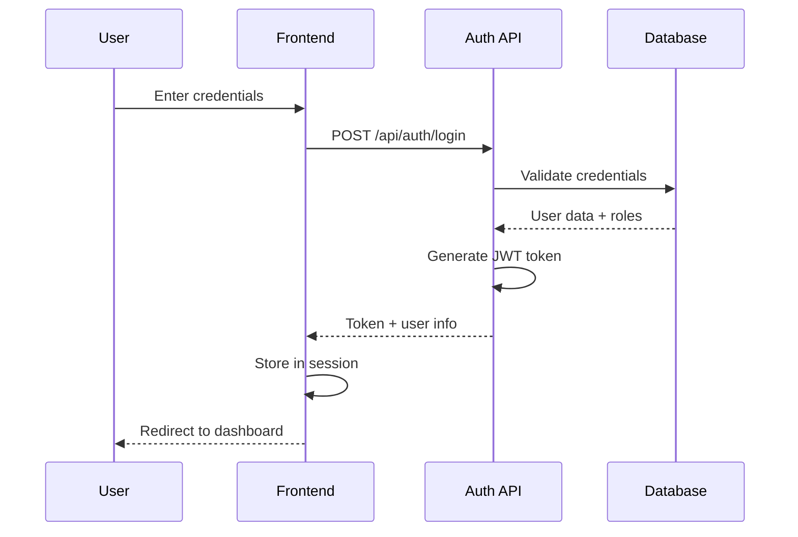
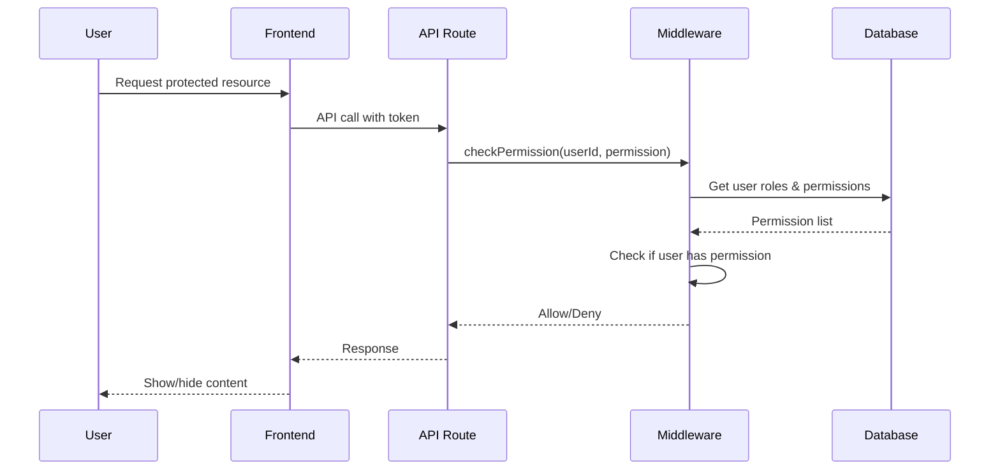
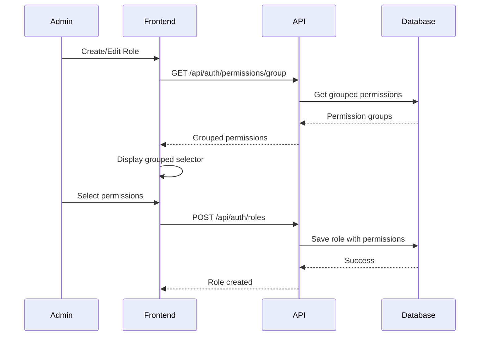
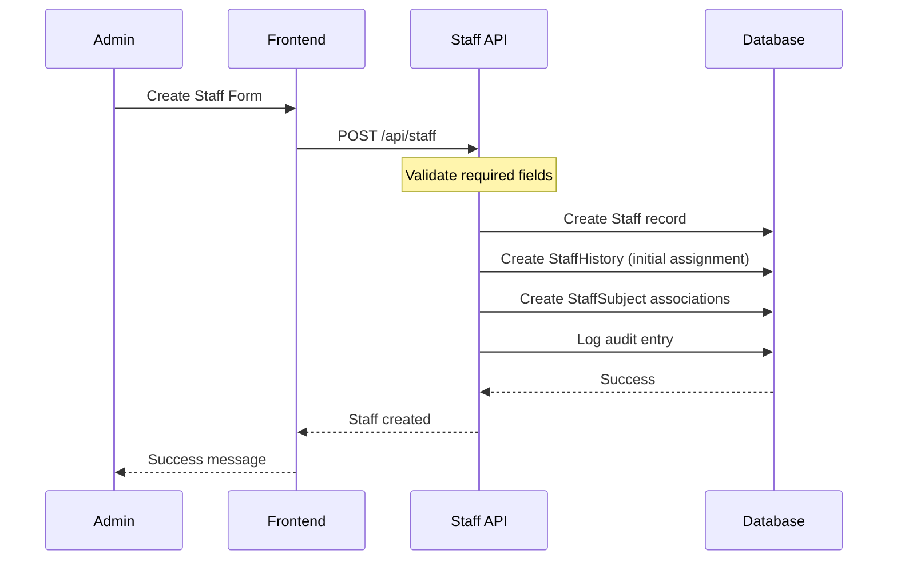
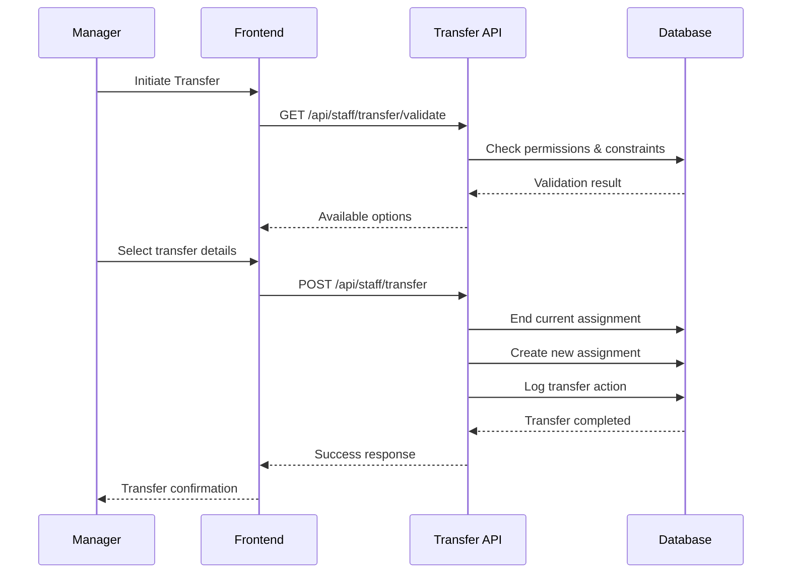
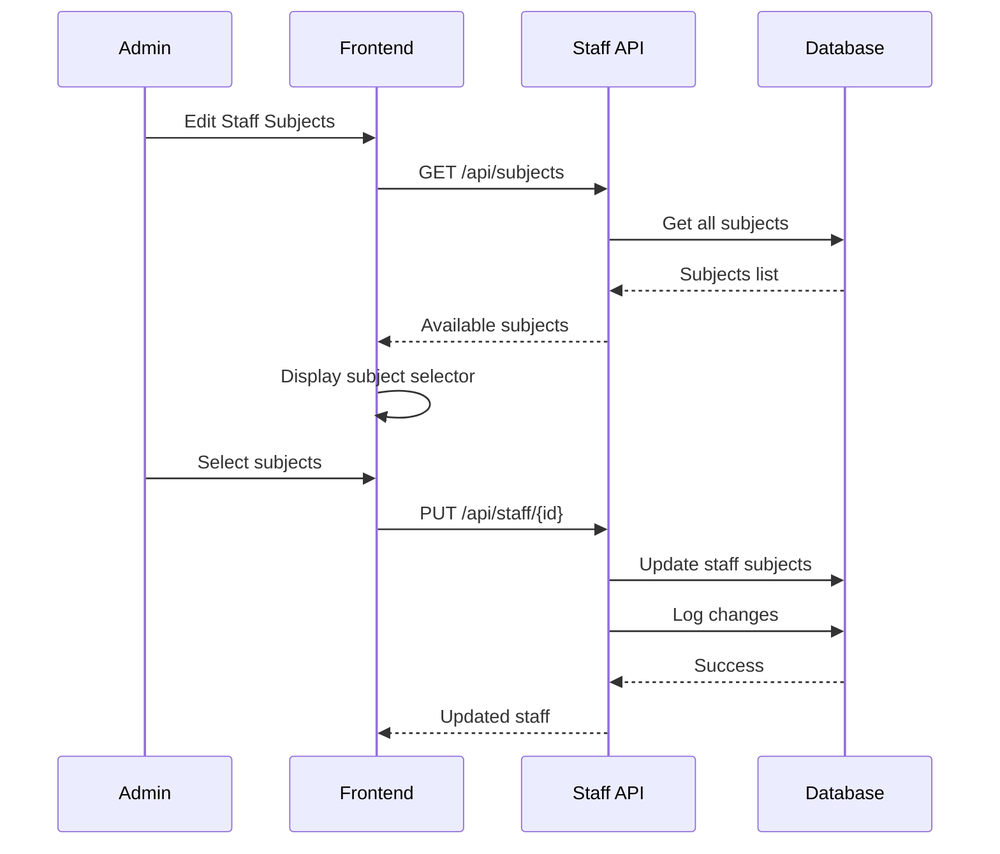

# Teacher Management System - Complete Flow Guideline

## Table of Contents
1. [System Architecture Overview](#system-architecture-overview)
2. [Authentication & Authorization Flow](#authentication--authorization-flow)
3. [Permission Grouping System](#permission-grouping-system)
4. [Organization-Level Access Control](#organization-level-access-control)
5. [Hierarchical Level Management](#hierarchical-level-management)
6. [Staff Management & History](#staff-management--history)
7. [Staff Transfer System](#staff-transfer-system)
8. [Staff Subject Skills](#staff-subject-skills)
9. [Location Management](#location-management)
10. [Audit & Activity Logging](#audit--activity-logging)
11. [API Endpoints Reference](#api-endpoints-reference)
12. [Frontend Integration Guidelines](#frontend-integration-guidelines)

---

## System Architecture Overview

### Technology Stack
- **Backend**: Next.js 14 with App Router
- **Database**: MongoDB with Prisma ORM
- **Authentication**: NextAuth.js
- **Authorization**: Role-Based Access Control (RBAC)
- **API**: RESTful API with Next.js API Routes

### Core Models & Relationships
```
User ←→ Role ←→ Permission ←→ PermissionGroup
User ←→ UserLevel ←→ LevelType
User ←→ Organization
Staff ←→ User (optional)
Staff ←→ StaffHistory ←→ Organization
Staff ←→ StaffSubject ←→ Subject
```

---

## Authentication & Authorization Flow

### 1. Login Process


### 2. Permission Checking Flow


### 3. Organization-Level Access
- Users are scoped to their organization
- API routes filter data by `organization_id`
- Users cannot access data from other organizations
- System managers can access all organizations

---

## Permission Grouping System

### 1. Permission Group Structure
```
PermissionGroup
├── name_en: "User Management"
├── name_kh: "ការគ្រប់គ្រងអ្នកប្រើប្រាស់"
├── code: "user_management"
└── permissions: [
    "user_create",
    "user_read", 
    "user_update",
    "user_delete"
]
```

### 2. Permission Assignment Flow


### 3. Frontend Implementation
```typescript
// Permission Group Selector Component
interface PermissionGroup {
  id: string;
  name_en: string;
  name_kh: string;
  code: string;
  permissions: Permission[];
}

// Usage in role form
const [permissionGroups, setPermissionGroups] = useState<PermissionGroup[]>([]);

// Render grouped permissions
{permissionGroups.map(group => (
  <div key={group.id}>
    <h3>{group.name_en}</h3>
    {group.permissions.map(permission => (
      <Checkbox
        key={permission.id}
        checked={selectedPermissions.includes(permission.id)}
        onChange={(checked) => handlePermissionChange(permission.id, checked)}
      >
        {permission.name_en}
      </Checkbox>
    ))}
  </div>
))}
```

---

## Organization-Level Access Control

### 1. User Organization Assignment
```typescript
// User creation with organization
const user = await prisma.user.create({
  data: {
    username: "teacher001",
    password: hashedPassword,
    organization_id: "org123",
    user_level_id: "level456",
    is_active: true
  }
});
```

### 2. API Data Filtering
```typescript
// Example: Get users filtered by organization
export async function GET(request: NextRequest) {
  const session = await getServerSession(authOptions);
  const user = await prisma.user.findUnique({
    where: { id: session.user.id },
    include: { organization: true, user_level: true }
  });

  // Filter by organization
  const where: any = {};
  if (user.user_level.level_type.level_order > 1) {
    // Not system manager - filter by organization
    where.organization_id = user.organization_id;
  }

  const users = await prisma.user.findMany({
    where,
    include: { organization: true, roles: true }
  });
}
```

### 3. Access Control Matrix
| User Level | Can Access | Scope |
|------------|------------|-------|
| System Manager (Level 1) | All organizations | Global |
| Provincial Manager (Level 2) | Province organizations | Provincial |
| District Manager (Level 3) | District organizations | District |
| School Manager (Level 4) | School organizations | School |

---

## Hierarchical Level Management

### 1. Level Type Configuration
```typescript
// Level Type with hierarchy
const levelType = await prisma.levelType.create({
  data: {
    name_en: "Provincial Manager",
    name_kh: "អ្នកគ្រប់គ្រងខេត្ត",
    code: "provincial_manager",
    level_order: 2,
    can_manage_levels_ids: ["level3", "level4"], // Can manage district & school levels
    managed_by_levels_ids: ["level1"], // Managed by system manager
    is_active: true
  }
});
```

### 2. Level-Based Authorization
```typescript
// Check if user can manage target level
export async function canManageLevel(
  userLevelOrder: number, 
  targetLevelOrder: number
): Promise<boolean> {
  return userLevelOrder < targetLevelOrder;
}

// Usage in API
const userLevel = await getUserLevel(session.user.id);
const targetLevel = await getTargetLevel(targetLevelId);

if (!canManageLevel(userLevel.level_type.level_order, targetLevel.level_type.level_order)) {
  return NextResponse.json({ error: 'Insufficient permissions' }, { status: 403 });
}
```

### 3. Location Type Management
```typescript
// Location types with hierarchy
const locationTypes = [
  { code: "province", name_en: "Province", name_kh: "ខេត្ត", order: 1 },
  { code: "district", name_en: "District", name_kh: "ស្រុក", order: 2, parent: "province" },
  { code: "commune", name_en: "Commune", name_kh: "ឃុំ", order: 3, parent: "district" },
  { code: "village", name_en: "Village", name_kh: "ភូមិ", order: 4, parent: "commune" },
  { code: "school", name_en: "School", name_kh: "សាលា", order: 5, parent: "village" }
];
```

---

## Staff Management & History

### 1. Staff Creation Flow


### 2. Staff History Tracking
```typescript
// Staff History Model
interface StaffHistory {
  id: string;
  staff_id: string;
  organization_id: string;
  position: string;
  start_date: Date;
  end_date?: Date;
  staff_level_id?: string;
  salary_level_id?: string;
  academic_year_id?: string;
  changed_by_id?: string;
  note?: string;
}

// Create history entry on staff transfer
const historyEntry = await prisma.staffHistory.create({
  data: {
    staff_id: staffId,
    organization_id: newOrganizationId,
    position: newPosition,
    start_date: new Date(),
    staff_level_id: newStaffLevelId,
    salary_level_id: newSalaryLevelId,
    academic_year_id: currentAcademicYearId,
    changed_by_id: session.user.id,
    note: transferReason
  }
});
```

### 3. Historical Data Queries
```typescript
// Get staff history
const staffHistory = await prisma.staffHistory.findMany({
  where: { staff_id: staffId },
  include: {
    organization: true,
    staff_level: true,
    salary_level: true,
    academic_year: true,
    changed_by: true
  },
  orderBy: { start_date: 'desc' }
});

// Get current assignment
const currentAssignment = await prisma.staffHistory.findFirst({
  where: { 
    staff_id: staffId,
    end_date: null // Current assignment
  },
  include: {
    organization: true,
    staff_level: true,
    salary_level: true
  }
});
```

---

## Staff Transfer System

### 1. Transfer Process Flow


### 2. Transfer Validation
```typescript
// Transfer validation logic
export async function validateTransfer(
  staffId: string,
  targetOrganizationId: string,
  userId: string
): Promise<TransferValidation> {
  // Check if user can transfer staff
  const user = await getUserWithLevel(userId);
  const staff = await getStaffWithCurrentAssignment(staffId);
  
  // Level-based authorization
  if (!canManageLevel(user.level_type.level_order, staff.current_assignment.level_type.level_order)) {
    return { valid: false, error: 'Insufficient permissions' };
  }
  
  // Check if target organization is accessible
  if (!canAccessOrganization(user, targetOrganizationId)) {
    return { valid: false, error: 'Cannot access target organization' };
  }
  
  // Check academic year constraints
  if (!isTransferAllowedInCurrentAcademicYear()) {
    return { valid: false, error: 'Transfers not allowed in current academic year' };
  }
  
  return { valid: true };
}
```

### 3. Transfer API Implementation
```typescript
// POST /api/staff/transfer
export async function POST(request: NextRequest) {
  const session = await getServerSession(authOptions);
  const { staff_id, organization_id, position, staff_level_id, salary_level_id, note } = await request.json();
  
  // Validate transfer
  const validation = await validateTransfer(staff_id, organization_id, session.user.id);
  if (!validation.valid) {
    return NextResponse.json({ error: validation.error }, { status: 400 });
  }
  
  // End current assignment
  await prisma.staffHistory.updateMany({
    where: { 
      staff_id,
      end_date: null // Current assignment
    },
    data: { end_date: new Date() }
  });
  
  // Create new assignment
  const newAssignment = await prisma.staffHistory.create({
    data: {
      staff_id,
      organization_id,
      position,
      start_date: new Date(),
      staff_level_id,
      salary_level_id,
      academic_year_id: await getCurrentAcademicYearId(),
      changed_by_id: session.user.id,
      note
    }
  });
  
  // Log transfer
  await prisma.auditLog.create({
    data: {
      active: 'TRANSFER',
      timestamp: new Date(),
      user_id: session.user.id,
      details: `Staff transfer: ${staff_id} to ${organization_id}`
    }
  });
  
  return NextResponse.json({ 
    message: 'Transfer completed successfully',
    data: newAssignment 
  });
}
```

---

## Staff Subject Skills

### 1. Subject Management
```typescript
// Subject model
interface Subject {
  id: string;
  name_en: string;
  name_kh: string;
  code: string;
  is_active: boolean;
}

// Staff-Subject relationship
interface StaffSubject {
  id: string;
  staff_id: string;
  subject_id: string;
  staff: Staff;
  subject: Subject;
}
```

### 2. Subject Assignment Flow


### 3. Subject Skills API
```typescript
// Update staff with subjects
export async function PUT(request: NextRequest, { params }: { params: { id: string } }) {
  const { subjectIds, ...staffData } = await request.json();
  
  // Update staff basic info
  const updatedStaff = await prisma.staff.update({
    where: { id: params.id },
    data: staffData
  });
  
  // Update subject associations
  if (subjectIds !== undefined) {
    // Remove existing associations
    await prisma.staffSubject.deleteMany({
      where: { staff_id: params.id }
    });
    
    // Create new associations
    if (subjectIds.length > 0) {
      await Promise.all(
        subjectIds.map((subjectId: string) =>
          prisma.staffSubject.create({
            data: {
              staff_id: params.id,
              subject_id: subjectId
            }
          })
        )
      );
    }
  }
  
  return NextResponse.json({ 
    message: 'Staff updated successfully',
    data: updatedStaff 
  });
}
```

---

## Location Management

### 1. Hierarchical Location Structure
```
Province
├── District
│   ├── Commune
│   │   ├── Village
│   │   │   └── Organization (School)
│   │   └── Organization (Commune Office)
│   └── Organization (District Office)
└── Organization (Provincial Office)
```

### 2. Location CRUD Operations
```typescript
// Location creation with audit trail
export async function POST(request: NextRequest) {
  const session = await getServerSession(authOptions);
  const { name_en, name_kh, code, parent_id, location_type_id } = await request.json();
  
  // Validate location type permissions
  const userLevel = await getUserLevel(session.user.id);
  const canManage = await canManageLocationType(userLevel.level_type_id, location_type_id);
  
  if (!canManage) {
    return NextResponse.json({ error: 'Cannot manage this location type' }, { status: 403 });
  }
  
  // Create location
  const location = await prisma[locationType].create({
    data: {
      name_en,
      name_kh,
      code,
      parent_id,
      created_by: session.user.id,
      is_active: true
    }
  });
  
  // Log creation
  await prisma.auditLog.create({
    data: {
      active: 'CREATE',
      timestamp: new Date(),
      user_id: session.user.id,
      details: `Created ${locationType}: ${name_en}`
    }
  });
  
  return NextResponse.json({ data: location }, { status: 201 });
}
```

### 3. Location Hierarchy Queries
```typescript
// Get location tree
export async function getLocationTree(locationType: string, parentId?: string) {
  const where: any = { is_active: true };
  if (parentId) {
    where.parent_id = parentId;
  } else {
    where.parent_id = null; // Root level
  }
  
  return await prisma[locationType].findMany({
    where,
    include: {
      children: true,
      organizations: true
    },
    orderBy: { name_en: 'asc' }
  });
}

// Get full location path
export async function getLocationPath(locationId: string, locationType: string) {
  const path = [];
  let current = await prisma[locationType].findUnique({
    where: { id: locationId },
    include: { parent: true }
  });
  
  while (current) {
    path.unshift(current);
    if (current.parent) {
      current = await prisma[current.parent.type].findUnique({
        where: { id: current.parent.id },
        include: { parent: true }
      });
    } else {
      break;
    }
  }
  
  return path;
}
```

---

## Audit & Activity Logging

### 1. Audit Log Structure
```typescript
interface AuditLog {
  id: string;
  active: 'CREATE' | 'UPDATE' | 'DELETE' | 'LOGIN' | 'LOGOUT' | 'TRANSFER';
  timestamp: Date;
  user_id: string;
  details: string;
  user: User;
}

interface ActiveLog {
  id: string;
  session_id: string;
  start_at: Date;
  ended_at?: Date;
  ip_address: string;
  location?: string;
  user_agent?: string;
  details?: string;
  user_id: string;
  user: User;
}
```

### 2. Audit Logging Implementation
```typescript
// Audit service
export class AuditService {
  static async logAction(
    userId: string,
    action: string,
    details: string,
    timestamp: Date = new Date()
  ) {
    return await prisma.auditLog.create({
      data: {
        active: action,
        timestamp,
        user_id: userId,
        details
      }
    });
  }
  
  static async logUserActivity(
    userId: string,
    sessionId: string,
    ipAddress: string,
    userAgent: string,
    location?: string
  ) {
    return await prisma.activeLog.create({
      data: {
        session_id: sessionId,
        start_at: new Date(),
        ip_address: ipAddress,
        user_agent: userAgent,
        location,
        user_id: userId
      }
    });
  }
}
```

### 3. Activity Tracking
```typescript
// Track user sessions
export async function trackUserSession(userId: string, sessionData: any) {
  const activeLog = await prisma.activeLog.create({
    data: {
      session_id: sessionData.sessionId,
      start_at: new Date(),
      ip_address: sessionData.ipAddress,
      user_agent: sessionData.userAgent,
      location: sessionData.location,
      user_id: userId
    }
  });
  
  return activeLog;
}

// End user session
export async function endUserSession(sessionId: string) {
  return await prisma.activeLog.updateMany({
    where: { session_id: sessionId },
    data: { ended_at: new Date() }
  });
}
```

---

## API Endpoints Reference

### Authentication & Authorization
```
POST   /api/auth/login                    # User login
POST   /api/auth/logout                   # User logout
GET    /api/auth/users                    # Get users (filtered by org)
POST   /api/auth/users                    # Create user
GET    /api/auth/users/[id]               # Get user by ID
PUT    /api/auth/users/[id]               # Update user
DELETE /api/auth/users/[id]               # Delete user

GET    /api/auth/roles                    # Get roles
POST   /api/auth/roles                    # Create role
GET    /api/auth/roles/[id]               # Get role by ID
PUT    /api/auth/roles/[id]               # Update role
DELETE /api/auth/roles/[id]               # Delete role

GET    /api/auth/permissions              # Get permissions
GET    /api/auth/permissions/group        # Get grouped permissions
POST   /api/auth/permissions/group        # Create permission group
PUT    /api/auth/permissions/group/[id]   # Update permission group
DELETE /api/auth/permissions/group/[id]   # Delete permission group

GET    /api/auth/audit-logs               # Get audit logs
GET    /api/auth/active-logs              # Get active sessions
```

### Staff Management
```
GET    /api/staff                         # Get staff (filtered by org)
POST   /api/staff                         # Create staff
GET    /api/staff/[id]                    # Get staff by ID
PUT    /api/staff/[id]                    # Update staff
DELETE /api/staff/[id]                    # Delete staff

POST   /api/staff/transfer                # Transfer staff
GET    /api/staff/transfer/validate       # Validate transfer

GET    /api/staff-levels                  # Get staff levels
POST   /api/staff-levels                  # Create staff level
GET    /api/staff-levels/[id]             # Get staff level by ID
PUT    /api/staff-levels/[id]             # Update staff level
DELETE /api/staff-levels/[id]             # Delete staff level

GET    /api/salary-levels                 # Get salary levels
POST   /api/salary-levels                 # Create salary level
GET    /api/salary-levels/[id]            # Get salary level by ID
PUT    /api/salary-levels/[id]            # Update salary level
DELETE /api/salary-levels/[id]            # Delete salary level
```

### Location Management
```
GET    /api/locations/provinces           # Get provinces
POST   /api/locations/provinces           # Create province
GET    /api/locations/provinces/[id]      # Get province by ID
PUT    /api/locations/provinces/[id]      # Update province
DELETE /api/locations/provinces/[id]      # Delete province

GET    /api/locations/districts           # Get districts
POST   /api/locations/districts           # Create district
GET    /api/locations/districts/[id]      # Get district by ID
PUT    /api/locations/districts/[id]      # Update district
DELETE /api/locations/districts/[id]      # Delete district

GET    /api/locations/communes            # Get communes
POST   /api/locations/communes            # Create commune
GET    /api/locations/communes/[id]       # Get commune by ID
PUT    /api/locations/communes/[id]       # Update commune
DELETE /api/locations/communes/[id]       # Delete commune

GET    /api/locations/villages            # Get villages
POST   /api/locations/villages            # Create village
GET    /api/locations/villages/[id]       # Get village by ID
PUT    /api/locations/villages/[id]       # Update village
DELETE /api/locations/villages/[id]       # Delete village

GET    /api/locations/organizations       # Get organizations
POST   /api/locations/organizations       # Create organization
GET    /api/locations/organizations/[id]  # Get organization by ID
PUT    /api/locations/organizations/[id]  # Update organization
DELETE /api/locations/organizations/[id]  # Delete organization
```

### Academic & Subject Management
```
GET    /api/academic-years                # Get academic years
POST   /api/academic-years                # Create academic year
GET    /api/academic-years/[id]           # Get academic year by ID
PUT    /api/academic-years/[id]           # Update academic year
DELETE /api/academic-years/[id]           # Delete academic year

GET    /api/subjects                      # Get subjects
POST   /api/subjects                      # Create subject
GET    /api/subjects/[id]                 # Get subject by ID
PUT    /api/subjects/[id]                 # Update subject
DELETE /api/subjects/[id]                 # Delete subject
```

---

## Frontend Integration Guidelines

### 1. Permission-Based UI Rendering
```typescript
// Permission hook
export function usePermission(permission: string) {
  const { data: session } = useSession();
  const [hasPermission, setHasPermission] = useState(false);
  
  useEffect(() => {
    if (session?.user) {
      checkUserPermission(session.user.id, permission)
        .then(setHasPermission);
    }
  }, [session, permission]);
  
  return hasPermission;
}

// Usage in components
function UserManagementPage() {
  const canCreateUser = usePermission('user_create');
  const canEditUser = usePermission('user_update');
  
  return (
    <div>
      {canCreateUser && (
        <Button onClick={handleCreateUser}>Create User</Button>
      )}
      
      {users.map(user => (
        <UserCard 
          key={user.id} 
          user={user}
          canEdit={canEditUser}
        />
      ))}
    </div>
  );
}
```

### 2. Organization-Scoped Data Fetching
```typescript
// API client with organization context
export class ApiClient {
  private baseUrl: string;
  private session: any;
  
  constructor(session: any) {
    this.baseUrl = '/api';
    this.session = session;
  }
  
  async getUsers(params?: any) {
    const queryString = new URLSearchParams(params).toString();
    const response = await fetch(`${this.baseUrl}/auth/users?${queryString}`, {
      headers: {
        'Authorization': `Bearer ${this.session.accessToken}`
      }
    });
    return response.json();
  }
  
  async createUser(userData: any) {
    const response = await fetch(`${this.baseUrl}/auth/users`, {
      method: 'POST',
      headers: {
        'Content-Type': 'application/json',
        'Authorization': `Bearer ${this.session.accessToken}`
      },
      body: JSON.stringify(userData)
    });
    return response.json();
  }
}
```

### 3. Dynamic Sidebar Based on Permissions
```typescript
// Sidebar configuration
const sidebarConfig = [
  {
    title: 'User Management',
    icon: 'users',
    permission: 'user_read',
    children: [
      { title: 'Users', path: '/users', permission: 'user_read' },
      { title: 'Roles', path: '/roles', permission: 'role_read' },
      { title: 'Permissions', path: '/permissions', permission: 'permission_read' }
    ]
  },
  {
    title: 'Staff Management',
    icon: 'staff',
    permission: 'staff_read',
    children: [
      { title: 'Staff', path: '/staff', permission: 'staff_read' },
      { title: 'Transfers', path: '/transfers', permission: 'staff_transfer' },
      { title: 'History', path: '/staff-history', permission: 'staff_history_read' }
    ]
  },
  {
    title: 'Location Management',
    icon: 'location',
    permission: 'location_read',
    children: [
      { title: 'Provinces', path: '/locations/provinces', permission: 'province_read' },
      { title: 'Districts', path: '/locations/districts', permission: 'district_read' },
      { title: 'Organizations', path: '/locations/organizations', permission: 'organization_read' }
    ]
  }
];

// Sidebar component
function Sidebar() {
  const { data: session } = useSession();
  const [menuItems, setMenuItems] = useState([]);
  
  useEffect(() => {
    if (session?.user) {
      // Filter menu items based on user permissions
      const filteredItems = sidebarConfig.filter(item => 
        hasPermission(session.user.id, item.permission)
      );
      setMenuItems(filteredItems);
    }
  }, [session]);
  
  return (
    <nav>
      {menuItems.map(item => (
        <MenuItem key={item.title} item={item} />
      ))}
    </nav>
  );
}
```

### 4. Form Validation & Error Handling
```typescript
// Form validation with API feedback
export function useFormValidation<T>(initialData: T) {
  const [data, setData] = useState<T>(initialData);
  const [errors, setErrors] = useState<Record<string, string>>({});
  const [isSubmitting, setIsSubmitting] = useState(false);
  
  const validate = (validationRules: ValidationRules) => {
    const newErrors: Record<string, string> = {};
    
    Object.keys(validationRules).forEach(field => {
      const value = data[field];
      const rules = validationRules[field];
      
      if (rules.required && !value) {
        newErrors[field] = `${field} is required`;
      }
      
      if (rules.pattern && !rules.pattern.test(value)) {
        newErrors[field] = rules.message || `Invalid ${field}`;
      }
    });
    
    setErrors(newErrors);
    return Object.keys(newErrors).length === 0;
  };
  
  const handleSubmit = async (submitFn: (data: T) => Promise<any>) => {
    setIsSubmitting(true);
    try {
      const result = await submitFn(data);
      return result;
    } catch (error) {
      if (error.response?.data?.errors) {
        setErrors(error.response.data.errors);
      }
      throw error;
    } finally {
      setIsSubmitting(false);
    }
  };
  
  return { data, setData, errors, isSubmitting, validate, handleSubmit };
}
```

---

## Best Practices & Security Guidelines

### 1. Security Best Practices
- Always validate user permissions before API operations
- Use organization-level data filtering
- Implement proper input validation and sanitization
- Log all sensitive operations
- Use HTTPS in production
- Implement rate limiting for API endpoints

### 2. Performance Optimization
- Use database indexes for frequently queried fields
- Implement pagination for large datasets
- Use caching for static data (locations, subjects, etc.)
- Optimize database queries with proper includes
- Implement lazy loading for UI components

### 3. Error Handling
- Provide meaningful error messages
- Log errors with proper context
- Implement graceful degradation
- Use proper HTTP status codes
- Handle network errors gracefully

### 4. Testing Strategy
- Unit tests for business logic
- Integration tests for API endpoints
- E2E tests for critical user flows
- Permission testing for all endpoints
- Data validation testing

This comprehensive flow guideline covers all major features of the Teacher Management System, providing both technical implementation details and practical usage guidelines. 